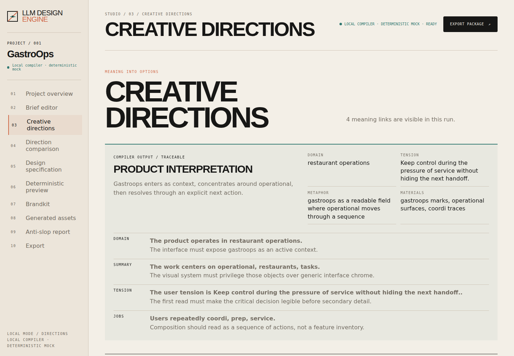
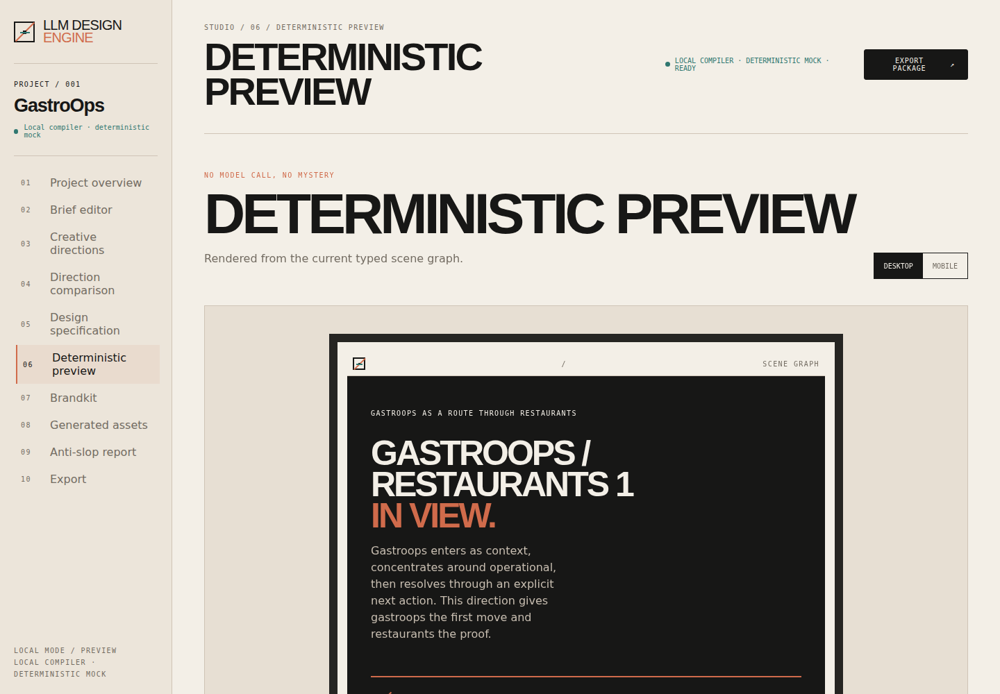

# LLM Design Engine

**Design before code.**

LLM Design Engine turns product meaning into original, agent-executable UI direction.


A creative director and design compiler for coding agents. It turns a brief into a domain interpretation, a visual metaphor, an original composition, a structured design document, a deterministic preview, and implementation instructions an agent can execute.

> Stop asking coding agents to design. Give them a design they can execute.

## Why this exists

Coding agents can write frontend code, but unexamined prompts converge on split heroes, purple gradients, glass panels, rounded card farms, generic dashboards, and visuals unrelated to the product. LLM Design Engine makes the decisions visible before implementation begins:

```text
product brief → domain interpretation → creative metaphor → visual narrative
→ original composition → structured design specification → deterministic preview
→ agent implementation instructions
```

It does not choose a theme, template, preset, component library, or cloned style. Every direction must explain its metaphor, material language, domain objects, composition, typography, interaction concept, and refusal list.

## Start in 60 seconds

**Requirements:** Node.js 22+ and pnpm 10.x.

```bash
git clone https://github.com/llmpolska/llm-design-engine.git
cd llm-design-engine
pnpm run setup
pnpm --filter @llm-design-engine/studio dev
```

`pnpm run setup` validates the runtime, runs `pnpm install --frozen-lockfile`, and builds the workspace. Then open [http://127.0.0.1:4174](http://127.0.0.1:4174), choose **Brief editor**, enter a product name and one-line summary, add the domain and operating tension, and select **Save and shape directions**.

## Choose your path

| You want to…                            | Use            | Start here                                    | Result                                                       |
| --------------------------------------- | -------------- | --------------------------------------------- | ------------------------------------------------------------ |
| Review a direction visually             | **Studio GUI** | `pnpm --filter @llm-design-engine/studio dev` | Brief → directions → specification → preview → lint → export |
| Create design artifacts in a repository | **CLI**        | `pnpm lde -- init`                            | Portable `.design/` Markdown and JSON artifacts              |
| Let a coding agent call the compiler    | **MCP**        | Configure the local STDIO server              | Tools for Claude Code, Codex, OpenCode, and Oh My Pi         |

## What works today

| Mode                         | Credentials                             | What it does                                                                                         |
| ---------------------------- | --------------------------------------- | ---------------------------------------------------------------------------------------------------- |
| **deterministic local/mock** | None                                    | Reproducible directions, SVG assets, previews, lint reports, brandkits, and exports.                 |
| **provider-backed**          | Configured endpoint, model, and API key | Uses OpenAI-compatible reasoning and optional image-generation adapters.                             |
| **Studio GastroOps fixture** | None                                    | Runs a reproducible local review journey. It does not claim to call an external LLM in fixture mode. |

The local path is fully usable without an AI key. When you configure a provider, the artifact contract stays the same; only the reasoning or asset-generation source changes.

## Studio GUI

```bash
pnpm --filter @llm-design-engine/studio dev
# http://127.0.0.1:4174
```

Studio is the local review surface for the complete design process:

1. **Brief editor** — describe the product, domain, tension, constraints, and preferences.
2. **Creative directions** — compare meaningfully different metaphors, materials, type character, and compositions.
3. **Design specification** — inspect the approved direction, semantic scene graph, responsive rules, and forbidden patterns.
4. **Deterministic preview** — render the direction without an image model.
5. **Brandkit, assets, lint, export** — review the identity system, asset provenance, anti-slop report, and agent handoff.

## CLI: create `.design/` in your project

Run these commands from the cloned repository root, or replace `pnpm lde` with the equivalent installed `lde` executable after publishing the CLI package.

```bash
pnpm lde -- init
pnpm lde -- brief \
  --name "GastroOps" \
  --summary "Operations for restaurant teams" \
  --domain "restaurant operations" \
  --tension "Keep control during service pressure without hiding the next handoff."
pnpm lde -- directions
pnpm lde -- generate
pnpm lde -- approve
pnpm lde -- brandkit
pnpm lde -- preview
pnpm lde -- lint
pnpm lde -- export
```

The output is a portable design package:

```text
.design/
├── BRIEF.md
├── DIRECTIONS.md
├── BRAND.md
├── pages/landing.design.md
├── brandkit.json
├── design.json
├── lint.json
├── assets/
├── previews/
├── EXPORT.md
└── manifest.json
```

`EXPORT.md` is the compact handoff for a coding agent. It carries the approved visual narrative, composition, responsive behavior, asset requirements, motion direction, and refusal list.

## MCP: give the compiler to your agent

The local MCP server exposes the design workflow over STDIO. Start it with:

```bash
pnpm mcp
```

Copy the configuration for your agent:

- [Claude Code](docs/mcp/claude-code.json)
- [Codex](docs/mcp/codex.json)
- [OpenCode](docs/mcp/opencode.json)
- [Oh My Pi](docs/mcp/oh-my-pi.json)

The MCP flow lets an agent create a brief, generate directions, compile a design, lint it, and export a handoff before writing frontend code.

## Reproducible evidence

Studio screenshots are generated from the visible GastroOps fixture flow, not assembled marketing mockups:

```bash
pnpm screenshots
```

The command starts Studio, compiles GastroOps through the browser interface, and writes a complete gallery to [`docs/assets/screenshots/`](docs/assets/screenshots/): overview, brief, directions, comparison, specification, desktop and mobile previews, brandkit, assets, lint, and export.





## GastroOps: before and after

**Before:** “Build a modern restaurant operations dashboard.” Product meaning, material language, hierarchy, and interaction behavior are implicit.

**After:** GastroOps starts from service pressure and the next handoff. Its approved direction is **Professional Kitchen Control Room**: blackened steel worktops, printed kitchen tickets, station markings, warm pass lighting, scratched stainless surfaces, a low command rail, and a pass surface as the focal point.

The example also includes genuinely different alternatives: **Field Ledger** (folded working pages), **Signal Map** (a route through operational noise), and **Material Archive**. Explore the complete case study in [`examples/gastroops/`](examples/gastroops/).

## Design format

`pages/*.design.md` is Markdown for people, with YAML frontmatter and a JSON-safe payload for tools. The design AST describes scene nodes, sections, responsive rules, typography, color roles, motion, assets, and forbidden patterns. See [`docs/design-format.md`](docs/design-format.md) for the complete contract.

```markdown
---
id: gastroops-landing
route: /
concept: professional-kitchen-control-room
status: approved
---

# Narrative

Steel worktops and ticket rails make the next handoff visible.

# Composition

## Hero

- height: 76svh
- focal-point: the pass surface
- heading-alignment: bottom-left

# Avoid

- purple gradients
- generic dashboard mockups
```

## Architecture

| Package             | Responsibility                                                                            |
| ------------------- | ----------------------------------------------------------------------------------------- |
| `core`              | Project brief, interpretation, direction, design AST, brandkit, asset, and lint contracts |
| `design-format`     | Zod validation plus Markdown frontmatter/parser/serializer                                |
| `creative-director` | Mock and OpenAI-compatible reasoning providers                                            |
| `renderer`          | Deterministic HTML/CSS/SVG preview output                                                 |
| `brandkit`          | Structured identity systems, tokens, press marks, image prompts                           |
| `image-provider`    | Disabled/mock and OpenAI-compatible image adapters                                        |
| `anti-slop`         | Deterministic generic-pattern warnings and score                                          |
| `repo-scanner`      | Extension point for future visual implementation verification                             |
| `cli`               | `lde` commands and local Hono API                                                         |
| `apps/studio`       | Local Vue design review surface                                                           |
| `apps/website`      | Product narrative and brand showcase                                                      |

Read [`docs/architecture.md`](docs/architecture.md) and [`docs/creative-pipeline.md`](docs/creative-pipeline.md) for the complete pipeline.

## Providers and assets

- **Mock reasoning provider** — deterministic and test-friendly.
- **OpenAI-compatible reasoning provider** — configurable through `LDE_REASONING_ENDPOINT`, `LDE_REASONING_MODEL`, and `LDE_REASONING_API_KEY`.
- **Disabled image provider** — intentional SVG placeholders with provenance metadata.
- **Mock image provider** — deterministic SVG assets for local development.
- **OpenAI-compatible image provider** — optional generation/refinement adapter.

Provider seams are documented in [`docs/providers.md`](docs/providers.md). Image assets are derived from the approved direction and record role, prompt, negative constraints, aspect ratio, placement, provider, model, and timestamp.

## Anti-slop report

`lde lint` returns a score where lower is better:

```text
AI Slop Score: 31/100
Warnings:
- Hero composition has no relationship to the project metaphor.
- Six visually identical cards were detected.
- Accent gradient is not explained by the visual language.
```

Rules cover generic split heroes, rounded/pill repetition, floating cards, unrelated gradients, glassmorphism, feature grids, abstract blobs, mockups, generic decisions, missing domain elements, stock imagery, centered text, and contrast. See [`docs/anti-slop.md`](docs/anti-slop.md).

## Website imagery

The website ships cohesive local SVG artwork for the foundry hero, blueprint transformation, brandkit board, GastroOps case study, social preview, repository banner, favicon, and app icon.

```bash
pnpm generate:website-assets
```

An image model is optional. The website remains complete without credentials.

## Supported integrations

The Markdown export is designed for Codex, Claude Code, OpenCode, Oh My Pi, and other coding agents. See [`docs/integrations.md`](docs/integrations.md) and [`AGENTS.md`](AGENTS.md).

## Project philosophy

- Meaning precedes surface.
- A metaphor earns its place by changing composition.
- Domain materials beat decorative polish.
- Constraints are part of the design, not a postscript.
- Determinism makes creative review testable.
- Provider choice must not change the artifact contract.
- Open source should expose the reasoning seams.

## Roadmap

See [`ROADMAP.md`](ROADMAP.md). Autonomous image-to-code and a full visual implementation verifier are intentionally deferred; clean extension points are included instead.

## Contributing

Read [`CONTRIBUTING.md`](CONTRIBUTING.md), follow [`AGENTS.md`](AGENTS.md), and keep changesets focused. Every behavior change needs a focused test and a no-key path.

## License and attribution

MIT licensed. Built and maintained by [LLMPolska](https://github.com/llmpolska).

Repository topics: `ai`, `design`, `frontend`, `coding-agents`, `mcp`, `typescript`, `vue`, `design-system`, `generative-ai`, `developer-tools`.
