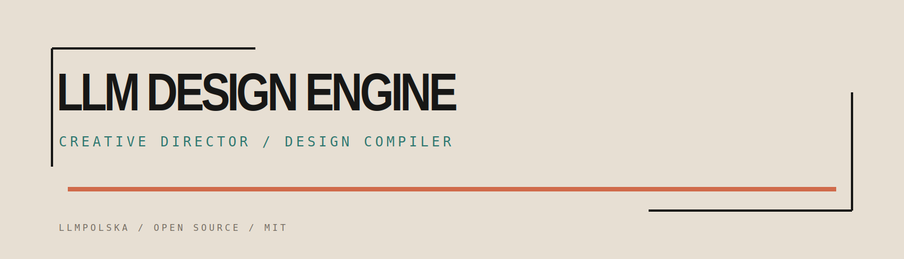

# LLM Design Engine
**Design before code.**
LLM Design Engine turns product meaning into original,
agent-executable UI direction.



Creative director and design compiler for coding agents. Give a product brief a domain interpretation, a visual metaphor, an original composition, a structured design document, a deterministic preview, and instructions a coding agent can execute.

> Stop asking coding agents to design. Give them a design they can execute.

## Why this exists

Coding agents are excellent at writing frontend code, but their unprompted design defaults converge on split heroes, purple gradients, glass panels, rounded card farms, generic dashboards, and visuals unrelated to the product. LLM Design Engine makes the invisible decisions explicit before implementation:

```text
product brief → domain interpretation → creative metaphor → visual narrative
→ original composition → structured design specification → deterministic preview
→ agent implementation instructions
```

The engine does not choose a theme, template, preset, component library, or cloned style. A direction must explain its metaphor, material language, domain objects, composition, typography, interaction concept, and refusal list.

## Quick start

Requirements: Node.js 22+ and pnpm 10+.

```bash
git clone https://github.com/llmpolska/llm-design-engine.git
cd llm-design-engine
pnpm install
pnpm build

mkdir my-project && cd my-project
../../packages/cli/dist/bin.js init
../../packages/cli/dist/bin.js brief \
  --name "GastroOps" \
  --summary "Operations for restaurant teams" \
  --domain "restaurant operations" \
  --tension "Keep control during the pressure of service."
../../packages/cli/dist/bin.js directions
../../packages/cli/dist/bin.js generate
../../packages/cli/dist/bin.js approve
../../packages/cli/dist/bin.js brandkit
../../packages/cli/dist/bin.js preview
../../packages/cli/dist/bin.js lint
../../packages/cli/dist/bin.js export
```

No AI credentials are required for the local path. Mock reasoning, deterministic SVG placeholders, the renderer, brandkit generation, linting, and export are all usable offline.

## Run the public site and studio

```bash
pnpm --filter @llm-design-engine/website dev
# http://localhost:4173

pnpm --filter @llm-design-engine/studio dev
# http://localhost:4174
```

The public site is intentionally a foundry/press-mark narrative rather than a conventional AI SaaS landing page. The studio uses the same paper, kiln-black, coral, teal, mono-annotation brand system.

## GastroOps before and after

**Before:** “Build a modern restaurant operations dashboard.” The phrase leaves product meaning, material language, hierarchy, and interaction behavior implicit.

**After:** the GastroOps example starts from service pressure and the next handoff. The approved direction is **Professional Kitchen Control Room**: blackened steel worktops, printed kitchen tickets, station markings, warm pass lighting, scratched stainless surfaces, a low command rail, and a pass surface as the focal point. Two genuinely different alternatives are included: **Field Ledger** (folded working pages) and **Signal Map** (a route through operational noise), plus Material Archive.

Open the complete case study in [`examples/gastroops/`](examples/gastroops/).

## Design format

Every project writes a `.design/` folder:

```text
.design/
├── BRIEF.md
├── DIRECTIONS.md
├── BRAND.md
├── pages/landing.design.md
├── brandkit.json
├── design.json
├── lint.json
├── assets/
├── previews/
├── EXPORT.md
└── manifest.json
```

`pages/*.design.md` is Markdown for people, with YAML frontmatter and a JSON-safe payload for tools. The design AST describes scene nodes, sections, responsive rules, typography, color roles, motion, assets, and forbidden patterns. See [`docs/design-format.md`](docs/design-format.md) for the complete contract.

```markdown
---
id: gastroops-landing
route: /
concept: professional-kitchen-control-room
status: approved
---
# Narrative
Steel worktops and ticket rails make the next handoff visible.
# Composition
## Hero
- height: 76svh
- focal-point: the pass surface
- heading-alignment: bottom-left
# Avoid
- purple gradients
- generic dashboard mockups
```

## Architecture

| Package | Responsibility |
| --- | --- |
| `core` | Project brief, interpretation, direction, design AST, brandkit, asset, and lint contracts |
| `design-format` | Zod validation plus Markdown frontmatter/parser/serializer |
| `creative-director` | Mock and OpenAI-compatible reasoning providers |
| `renderer` | Deterministic HTML/CSS/SVG preview output |
| `brandkit` | Structured identity systems, tokens, press marks, image prompts |
| `image-provider` | Disabled/mock and OpenAI-compatible image adapters |
| `anti-slop` | Deterministic generic-pattern warnings and score |
| `repo-scanner` | Extension point for future visual implementation verification |
| `cli` | `lde` commands and local Hono API |
| `apps/studio` | Local Vue design review surface |
| `apps/website` | Public product narrative and brand showcase |

Read [`docs/architecture.md`](docs/architecture.md) and [`docs/creative-pipeline.md`](docs/creative-pipeline.md).

## Providers

- Mock reasoning provider: deterministic and test-friendly.
- OpenAI-compatible reasoning provider: configurable endpoint, model, and API key through `LDE_REASONING_ENDPOINT`, `LDE_REASONING_MODEL`, and `LDE_REASONING_API_KEY`.
- Disabled image provider: produces intentional SVG placeholders and provenance metadata.
- Mock image provider: deterministic SVG assets for local development.
- OpenAI-compatible image provider: optional generation/refinement adapter.

Provider seams are documented in [`docs/providers.md`](docs/providers.md). Images are always derived from the approved direction and record role, prompt, negative constraints, aspect ratio, placement, provider, model, and timestamp.

## Anti-slop report

`lde lint` returns a score where lower is better:

```text
AI Slop Score: 31/100
Warnings:
- Hero composition has no relationship to the project metaphor.
- Six visually identical cards were detected.
- Accent gradient is not explained by the visual language.
```

Rules cover generic split heroes, rounded/pill repetition, floating cards, unrelated gradients, glassmorphism, feature grids, abstract blobs, mockups, generic decisions, missing domain elements, stock imagery, centered text, and contrast. See [`docs/anti-slop.md`](docs/anti-slop.md).

## Website imagery

The website ships cohesive, local SVG artwork for the foundry hero, blueprint transformation, brandkit board, GastroOps case study, social preview, repository banner, favicon, and app icon. Regenerate the intentional assets with:

```bash
pnpm generate:website-assets
```

An image model is optional. The finished site remains useful without credentials.

## Supported integrations

The Markdown export is designed to be pasted into Codex, Claude Code, OpenCode, Oh My Pi, or another coding agent. See [`docs/integrations.md`](docs/integrations.md) and [`AGENTS.md`](AGENTS.md).

## Project philosophy

- Meaning precedes surface.
- A metaphor earns its place by changing composition.
- Domain materials beat decorative polish.
- Constraints are part of the design, not a postscript.
- Determinism makes creative review testable.
- Provider choice must not change the artifact contract.
- Open source should expose the reasoning seams.

## Roadmap

See [`ROADMAP.md`](ROADMAP.md). Autonomous image-to-code and a full visual implementation verifier are intentionally deferred; clean extension points are included instead.

## Contributing

Read [`CONTRIBUTING.md`](CONTRIBUTING.md), follow the instructions in [`AGENTS.md`](AGENTS.md), and keep changesets focused. Every behavior change needs a focused test and a no-key path.

## License and attribution

MIT licensed. Built and maintained by [LLMPolska](https://github.com/llmpolska).

Repository topics: `ai`, `design`, `frontend`, `coding-agents`, `mcp`, `typescript`, `vue`, `design-system`, `generative-ai`, `developer-tools`.
